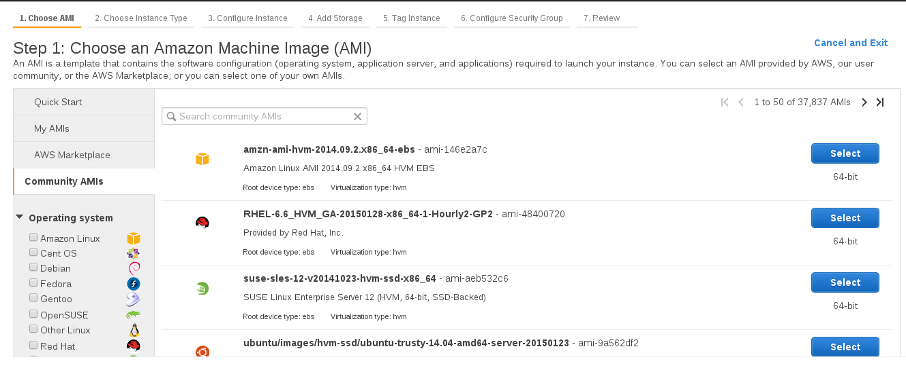
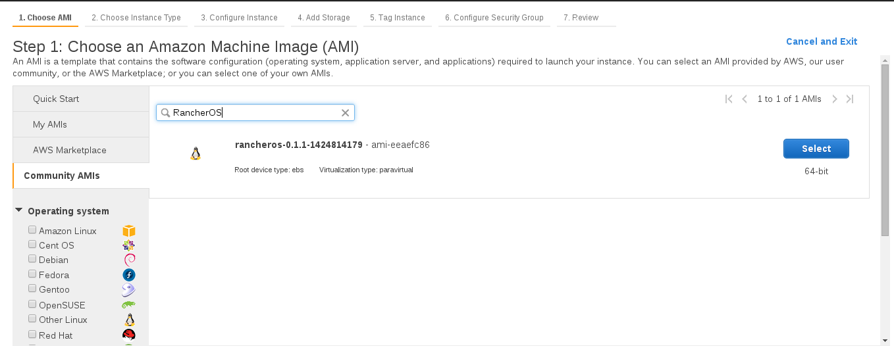
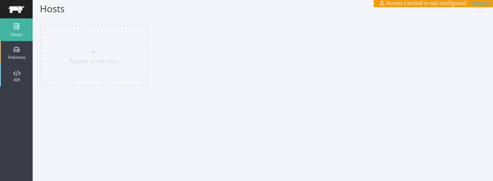
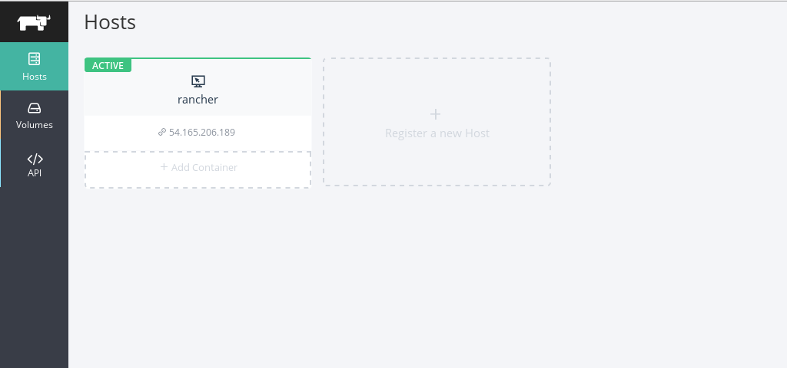

# RancherOS Getting Started Guide

RancherOS is a lightweight Linux distro designed from the ground up to run Docker containers. This guide provides detailed instructions on how to get started using RancherOS, and including:
  - An overview of the RancherOS architecture.
  - Installation instructions for running RancherOS on Vagrant or AWS. 
  - Overview of how to deploy Docker containers on RancherOS.
  - Instructions for deploying system containers.
  - Details on how to use RancherOS with Rancher management software.

## RancherOS Architecture

RancherOS is a 20MB distro which runs the latest Docker daemon as PID1, the first process on the system.  All other system services, like ntpd, rsyslog, and console, are running in Docker containers.

The first process on the system is called **System Docker** and it's responsible for managing the system services on RancherOS. System Docker replaces traditional init systems like systemd, and can be used to launch additional system services, which we will see later in this guide..

System Docker runs a special container called **User Docker** which is another Docker daemon responsible for managing all of the user’s containers. Any containers you launch as a user from the console will run inside this User Docker. This creates isolation from the System Docker containers, and ensures normal user commands don’t impact system services.


RancherOS is dramatically smaller than most traditional operating systems, because it only includes the services necessary to run Docker.  By removing unnecessary libraries and services, requirements for security patches and other maintenance are dramatically reduced.  This is possible because with Docker, users typically package all necessary libraries into their containers.

Another way in which RancherOS is designed specifically for running Docker is that it always runs the latest version of Docker. This allows users  to take advantage of the latest Docker capabilities and bug fixes. 

Like other minimalist Linux distributions, RancherOS boots incredibly quickly, generally in 5-10 seconds.  Starting Docker containers is nearly instant, similar to starting any other process. This quickness is ideal for organizations adopting microservices and autoscaling.

Docker is an open-source platform designed for developers, system admins, and DevOps, it is used to build, ship, and run containers, using simple yet powerful CLI, you can get started with Docker from [Docker user guide](https://docs.docker.com/userguide/).

## Installing RancherOS
### Using Vagrant
The RancherOS ISO file can be loaded to KVM, Vmware, or VirtualBox and installed as a normal Linux virtual machine. We can use Vagrant to build a RancherOS virtual machine on any of these virtualization providers.

Vagrant can be downloaded and installed from [here](http://www.vagrantup.com/downloads.html), after installing Vagrant you should clone the RancherOS Vagrant [repository](https://github.com/rancherio/os-vagrant):
```sh
$ git clone https://github.com/rancherio/os-vagrant.git
$ cd os-vagrant
```
The Vagrantfile, which will be used to build a virtual machine on top of virtualbox will be like the following:
```sh
Vagrant.configure(2) do |config|
  config.vm.box       = "rancheros"
  config.vm.box_url   = "http://cdn.rancher.io/vagrant/x86_64/prod/rancheros_virtualbox.box"
  config.ssh.username = "rancher"

  config.vm.provider "virtualbox" do |vb|
     vb.check_guest_additions = false
     vb.functional_vboxsf     = false
     vb.memory = "1024"
     vb.gui = true
  end

  config.vm.synced_folder ".", "/vagrant", disabled: true
end
```
Vagrantfile will use the second version of the configuration, and it will specify the vagrant box url, and will deploy the ssh keys to rancher user. After that it will specify virtualbox as the provider, note that RancherOS needs at least **1GB** RAM.

And now run **vagrant up** which will import the vagrant box and create the virtual machine with RancherOS installed, you should see:

```
…
…
==> default: Machine booted and ready!
```
### Running Rancher on AWS
RancherOS is available as an Amazon Web Services AMI, and can be easily run on EC2.  Let’s walk through how to import and create a RancherOS on EC2 machine:

- First login to your AWS console, and on the EC2 dashboard, click on **“Launch a new instance”**:


- Choose Community AMIs and search for RancherOS:


- After configuring the network, size of the instance, and the security groups, review the information of the instance and choose a ssh key pair to be used with the EC2instance:


- Download your new key pair, and then launch the instance, you should see the instance up and running:


If you prefer to use the AWS CLI the command below will launch a new instance using the RancherOS AMI: 

```sh
$ aws ec2 run-instances --image-id ami-eeaefc86 --count 1 \
--instance-type t1.micro --key-name MyKey --security-groups new-sg
```
where ami-eeaefc86 is the AMI of RancherOS in us-east-1 region. You can find the codes for AMIs in other regions on the RancherOS GitHub site. Now you can login to the RancherOS system:

```sh
$ ssh -i MyKey.pem rancher@<ip-of-ec2-instance>
[rancher@rancher ~]$
```

## A First Look At RancherOS

For the rest of the guide, I will use Vagrant locally to run RancherOS. Let’s run RancherOS and get a first look on the system and discover how to use it.

First to login to the system, use Vagrant ssh to authenticate with the private Vagrant key and login to the system:
```sh
$ vagrant ssh
[rancher@rancher ~]$
```
To see what processes are running on the system:
```sh
[rancher@rancher ~]$ ps aux
PID   USER 	COMMAND
1 	root 	docker -d -s overlay -b none --restart=false -H unix:///var/run/system-docker.sock
…..
308     root 	ntpd -d
314     root 	rsyslogd -n
322     root 	docker -d -s overlay --tlsverify --tlscacert=/etc/docker/tls/ca.pem --tlscert=/etc/docker/tls/serve
…..
```
As you can see that the first process on the system, PID1, is the Docker daemon we talked about earlier, called **system-docker**. This is where RancherOS runs system services like ntpd and rsyslogd. You can use the system-docker command to control the **system-docker** daemon. 

The other Docker daemon running on the system is **user-docker**, which can be accessed by using the normal docker command.

Use docker images command to see the images that the system has:
```sh
[rancher@rancher ~]$ docker images
REPOSITORY   TAG	IMAGE ID	CREATED	VIRTUAL SIZE
```
At this point there are no containers runing on the user-docker daemon. However, if  you run the same command against the sytem-docker instance you’ll see a number of system services that are shipped with RancherOS. [Note: system-docker can only be used by root, so it is necessary to use the sudo command whenever you want to interact with system-docker]:
```
[rancher@rancher ~]$ sudo system-docker images
REPOSITORY  TAG         IMAGE ID        CREATED     	VIRTUAL SIZE
syslog  	latest  	92855074bb56    46 hours ago    18.09 MB
syslog      v0.0.1      92855074bb56    46 hours ago    18.09 MB
ntp         latest      6560c12b3f56    46 hours ago    18.09 MB
ntp         v0.0.1      6560c12b3f56    46 hours ago    18.09 MB
rescue      latest      27c5b8ae9b7c    46 hours ago    18.1 MB
rescue      v0.0.1      27c5b8ae9b7c    46 hours ago    18.1 MB
console     latest      ee3a47bd7309    46 hours ago    18.1 MB
console     v0.0.1      ee3a47bd7309    46 hours ago	18.1 MB
userdocker  latest  	c0196a52a7c4    46 hours ago    18.35 MB
userdocker  v0.0.1      c0196a52a7c4    46 hours ago    18.35 MB
cloudinit   latest      7dc2bc8c2ad5	46 hours ago	18.09 MB
cloudinit   v0.0.1      7dc2bc8c2ad5    46 hours ago	18.09 MB
…….
```
All of these images are available for use by system docker daemon, some of them are run at boot time, and others,  such as the console, userdocker, rsyslog, and ntp containers are always running:
```
[rancher@rancher ~]$ sudo system-docker ps
CONTAINER ID    IMAGE   COMMAND      	CREATED         	STATUS         PORTS             NAMES
5ff08dbb57ce   console:latest 	"/usr/sbin/console.s   About an hour ago   Up About an hour console
56ac381d4acb   userdocker:latest   "/docker.sh"	About an hour ago   Up About an hour   userdocker    	 
f0dd31b1f7a8   syslog:latest   	"/syslog.sh"   	About an hour ago   Up About an hour    syslog         	 
0c7154630edd   ntp:latest      	"/ntp.sh"     	About an hour ago   Up About an hour    ntp
```
## Using RancherCTL
Another useful command that can be used with RancherOS is rancherctl which can be used to control and configure the system:
```sh
[rancher@rancher ~]$ rancherctl -v
rancherctl version 0.0.1
```
RancherOS state is controlled by simple document, rancherctl is used to edit the configuration of the system, to see for example the dns configuration of the system:
```sh
[rancher@rancher ~]$ sudo rancherctl config get dns
- 8.8.8.8
- 8.8.4.4
```
You can use rancherctl to customize the console and replace the native Busybox console with the consoles from other Linux distributions.  Initially RancherOS only supports the Ubuntu console, but other console support will be coming soon To enable the Ubuntu console use the following command:
```sh
[rancher@rancher ~]$ sudo rancherctl addon enable ubuntu-console;
[rancher@rancher ~]$ sudo reboot
```
After that you will be able to use Ubuntu console, to turn it off use disable instead of enable, and then reboot.
```sh
rancher@rancher:~$ sudo rancherctl addon disable ubuntu-console;
```
Note that any changes to the console or the system containers will be lost after reboots, any changes to /home or /opt will be persistent. Theconsole always executes **/opt/rancher/bin/start.sh** at each startup. 

## Deploying a Docker Container

The next thing is to deploy a normal Docker container on the user-docker daemon.  The RancherOS User docker daemon is identical to any other Docker environment, so all normal Docker commands work.

The following is an example of deploying a small nginx container installed on a busybox linux. To start a Docker container in user docker environment, use the following command:
```sh
rancher@rancher:~$ docker run -d --name nginx -p 8000:80 husseingalal/nginxbusy
be2a3c972b75e95cd162e7b4989f66e2b0ed1cb90529c52fd93f6c849b01840f
```
You can see that the nginx container is up and running, using docker ps command:
```sh
rancher@rancher:~$ docker ps
CONTAINER ID        IMAGE                           COMMAND             CREATED             STATUS              PORTS                  NAMES
be2a3c972b75        husseingalal/nginxbusy:latest   "/usr/sbin/nginx"   3 seconds ago       Up 2 seconds        0.0.0.0:8000->80/tcp   nginx
```
Note that the rancher user belongs to docker group, thats why I‘ve been able to use docker without sudo privileges.

## Deploying A System Service Container

The following is a simple docker container to set up linux-dash a minimal low-overhead web dashboard for monitoring linux servers, the Dockerfile will be like this:
```
FROM hwestphal/nodebox
MAINTAINER hussein.galal.ahmed.11@gmail.com

RUN opkg-install unzip
RUN curl -k -L -o master.zip https://github.com/afaqurk/linux-dash/archive/master.zip
RUN unzip master.zip
WORKDIR linux-dash-master
RUN npm install

ENTRYPOINT ["node","server"]
```
I used hwestphal/nodebox image which uses a busybox image and installs node.js and npm, then I downloaded the source code of linux-dash, finally I then ran the server. This Docker image is only 32MB, and linux-dash will run on port 80 by default.

To run this container with system-docker use the following command:
```sh
$ sudo system-docker run -d --net=host --name busydash husseingalal/busydash
```
Note that I used --net=host to tell system Docker not to containerize the container's networking, and use the host’s instead. After running the container you can see the monitoring server by accessing http://ip-of-the-server


To make the container survive during the reboots, you should create the /opt/rancher/bin/start.sh script, and add the docker start line to launch the docker at each startup:
```
$ sudo mkdir -p /opt/rancher/bin
$ sudo echo “sudo system-docker start busydash” >> /opt/rancher/bin/start.sh
$ sudo chmod 755 /opt/rancher/bin/start.sh
```
## Using Rancher Management platform with RancherOS

Rancher Management platform can be used to Manage Docker containers on RancherOS machines, in the following example I am going to illustrate how to set up Rancher platform and register RancherOS installed on EC2 machine, first you need to run Rancher platform on a machine using the following command:
```
root@Rancher-mng:~# docker run -d -p 8080:8080 rancher/server
```


The next step is to register your RancherOS machine with Rancher platform by executing the following command on the command line of the RancherOS host:
```
$ docker run --rm -it --privileged -v /var/run/docker.sock:/var/run/docker.sock rancher/agent http://MANAGEMENT_IP:8080
```
You should see the RancherOS machine on the management platform:



You can now start to deploy your Docker containers on RancherOS using the Rancher management platform, pretty cool, right?

## Conclusion

RancherOS is a simple Linux distribution ideal for running Docker.  It is very new, and evolving quickly. **It is absolutely not a production quality Linux distribution at this point**. However, by embracing containerization of system services and leveraging Docker for management, RancherOS hopes to provide a very reliable, and easy to manage OS for running containers.  To stay up to date, please follow the RancherOS [GitHub site](https://github.com/rancherio/os).  

