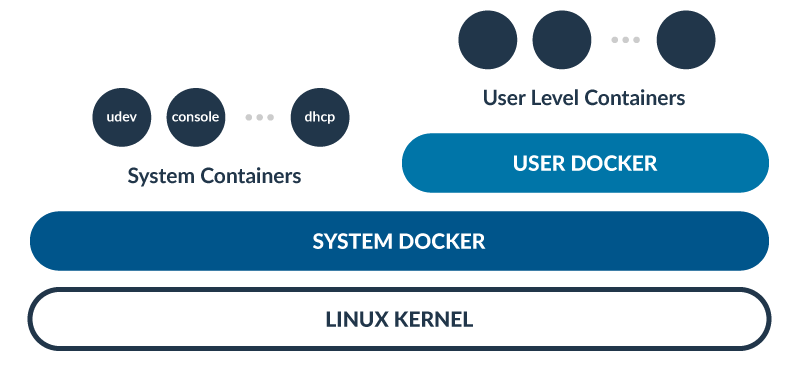

# RancherOS

The smallest, easiest way to run Docker in production at scale.  Everything in RancherOS is a container managed by Docker.  This includes system services such as udev and rsyslog.  RancherOS includes only the bare minimum amount of software needed to run Docker.  This keeps the binary download of RancherOS very small.  Everything else can be pulled in dynamically through Docker.

## How this works

Everything in RancherOS is a Docker container.  We accomplish this by launching two instances of
Docker.  One is what we call the system Docker which runs as the first process.  System Docker then launches
a container that runs the user Docker.  The user Docker is then the instance that gets primarily
used to create containers.  We created this separation because it seemed logical and also
it would really be bad if somebody did `docker rm -f $(docker ps -qa)` and deleted the entire OS.

## Release

- **v1.4.3 - Docker 18.03.1-ce - Linux 4.14.73**

### ISO

- https://releases.rancher.com/os/v1.4.3/rancheros.iso

### Additional Downloads

#### v1.4.3 Links

* https://releases.rancher.com/os/v1.4.3/initrd
* https://releases.rancher.com/os/v1.4.3/iso-checksums.txt
* https://releases.rancher.com/os/v1.4.3/rancheros-openstack.img
* https://releases.rancher.com/os/v1.4.3/rancheros-digitalocean.img
* https://releases.rancher.com/os/v1.4.3/rancheros-cloudstack.img
* https://releases.rancher.com/os/v1.4.3/rancheros-aliyun.vhd
* https://releases.rancher.com/os/v1.4.3/rancheros.ipxe
* https://releases.rancher.com/os/v1.4.3/rancheros-gce.tar.gz
* https://releases.rancher.com/os/v1.4.3/rootfs.tar.gz
* https://releases.rancher.com/os/v1.4.3/vmlinuz
* https://releases.rancher.com/os/v1.4.3/rancheros-vmware.iso

#### ARM Links

* https://releases.rancher.com/os/v1.4.3/rootfs_arm64.tar.gz
* https://releases.rancher.com/os/v1.4.3/rancheros-raspberry-pi64.zip

**Note**: you can use `http` instead of `https` in the above URLs, e.g. for iPXE.

### Amazon

SSH keys are added to the **`rancher`** user, so you must log in using the **rancher** user.

**HVM**

Region | Type | AMI
-------|------|------
eu-north-1 | HVM | [ami-0266966095dd33f50](https://eu-north-1.console.aws.amazon.com/ec2/home?region=eu-north-1#launchInstanceWizard:ami=ami-0266966095dd33f50)
ap-south-1 | HVM | [ami-0bf3c7748adf1c2ff](https://ap-south-1.console.aws.amazon.com/ec2/home?region=ap-south-1#launchInstanceWizard:ami=ami-0bf3c7748adf1c2ff)
eu-west-3 | HVM | [ami-0c7382d549b2c1d63](https://eu-west-3.console.aws.amazon.com/ec2/home?region=eu-west-3#launchInstanceWizard:ami=ami-0c7382d549b2c1d63)
eu-west-2 | HVM | [ami-080f8a28ad302627b](https://eu-west-2.console.aws.amazon.com/ec2/home?region=eu-west-2#launchInstanceWizard:ami=ami-080f8a28ad302627b)
eu-west-1 | HVM | [ami-08be98f221fa6dd25](https://eu-west-1.console.aws.amazon.com/ec2/home?region=eu-west-1#launchInstanceWizard:ami=ami-08be98f221fa6dd25)
ap-northeast-2 | HVM | [ami-0dfa41221a2eba99f](https://ap-northeast-2.console.aws.amazon.com/ec2/home?region=ap-northeast-2#launchInstanceWizard:ami=ami-0dfa41221a2eba99f)
ap-northeast-1 | HVM | [ami-0fddcd0e6d5ec78df](https://ap-northeast-1.console.aws.amazon.com/ec2/home?region=ap-northeast-1#launchInstanceWizard:ami=ami-0fddcd0e6d5ec78df)
sa-east-1 | HVM | [ami-00e75ee52cfebbab8](https://sa-east-1.console.aws.amazon.com/ec2/home?region=sa-east-1#launchInstanceWizard:ami=ami-00e75ee52cfebbab8)
ca-central-1 | HVM | [ami-04d140b8de634ddf3](https://ca-central-1.console.aws.amazon.com/ec2/home?region=ca-central-1#launchInstanceWizard:ami=ami-04d140b8de634ddf3)
ap-southeast-1 | HVM | [ami-0a813e47c90208bf5](https://ap-southeast-1.console.aws.amazon.com/ec2/home?region=ap-southeast-1#launchInstanceWizard:ami=ami-0a813e47c90208bf5)
ap-southeast-2 | HVM | [ami-05df7fb56f04f63e3](https://ap-southeast-2.console.aws.amazon.com/ec2/home?region=ap-southeast-2#launchInstanceWizard:ami=ami-05df7fb56f04f63e3)
eu-central-1 | HVM | [ami-0be585bd92533551f](https://eu-central-1.console.aws.amazon.com/ec2/home?region=eu-central-1#launchInstanceWizard:ami=ami-0be585bd92533551f)
us-east-1 | HVM | [ami-071ece35fd8f75bd9](https://us-east-1.console.aws.amazon.com/ec2/home?region=us-east-1#launchInstanceWizard:ami=ami-071ece35fd8f75bd9)
us-east-2 | HVM | [ami-014c1a9ddda965fb3](https://us-east-2.console.aws.amazon.com/ec2/home?region=us-east-2#launchInstanceWizard:ami=ami-014c1a9ddda965fb3)
us-west-1 | HVM | [ami-0d4aaf00afe4eab90](https://us-west-1.console.aws.amazon.com/ec2/home?region=us-west-1#launchInstanceWizard:ami=ami-0d4aaf00afe4eab90)
us-west-2 | HVM | [ami-0172914721778cc07](https://us-west-2.console.aws.amazon.com/ec2/home?region=us-west-2#launchInstanceWizard:ami=ami-0172914721778cc07)

Additionally, images are available with support for Amazon EC2 Container Service (ECS) [here](https://rancher.com/docs/os/v1.x/en/installation/amazon-ecs/#amazon-ecs-enabled-amis).

### Google Compute Engine

We are providing a disk image that users can download and import for use in Google Compute Engine. The image can be obtained from the release artifacts for RancherOS.

[Download Latest Image](https://releases.rancher.com/os/latest/rancheros-gce.tar.gz)

[Download Stable Image](https://releases.rancher.com/os/v1.4.3/rancheros-gce.tar.gz)

Please follow the directions at our [docs to launch in GCE](https://rancher.com/docs/os/v1.x/en/installation/running-rancheros/cloud/gce/).

## Documentation for RancherOS

Please refer to our [RancherOS Documentation](https://rancher.com/docs/os/v1.x/en/) website to read all about RancherOS. It has detailed information on how RancherOS works, getting-started and other details.

## Support, Discussion, and Community
If you need any help with RancherOS or Rancher, please join us at either our [Rancher forums](http://forums.rancher.com) or [#rancher IRC channel](http://webchat.freenode.net/?channels=rancher) where most of our team hangs out at.

For security issues, please email security@rancher.com instead of posting a public issue in GitHub.  You may (but are not required to) use the GPG key located on [Keybase](https://keybase.io/rancher).

Please submit any **RancherOS** bugs, issues, and feature requests to [rancher/os](//github.com/rancher/os/issues).

Please submit any **Rancher** bugs, issues, and feature requests to [rancher/rancher](//github.com/rancher/rancher/issues).

## License

Copyright (c) 2014-2018 [Rancher Labs, Inc.](http://rancher.com)

Licensed under the Apache License, Version 2.0 (the "License");
you may not use this file except in compliance with the License.
You may obtain a copy of the License at

[http://www.apache.org/licenses/LICENSE-2.0](http://www.apache.org/licenses/LICENSE-2.0)

Unless required by applicable law or agreed to in writing, software
distributed under the License is distributed on an "AS IS" BASIS,
WITHOUT WARRANTIES OR CONDITIONS OF ANY KIND, either express or implied.
See the License for the specific language governing permissions and
limitations under the License.
